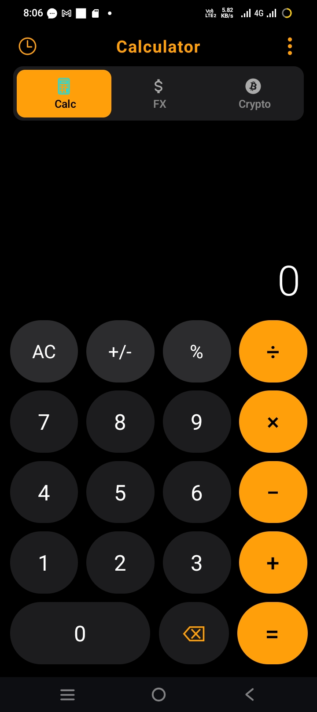
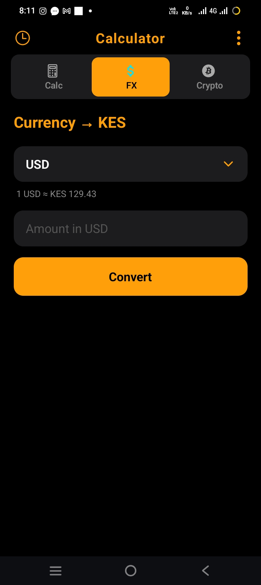
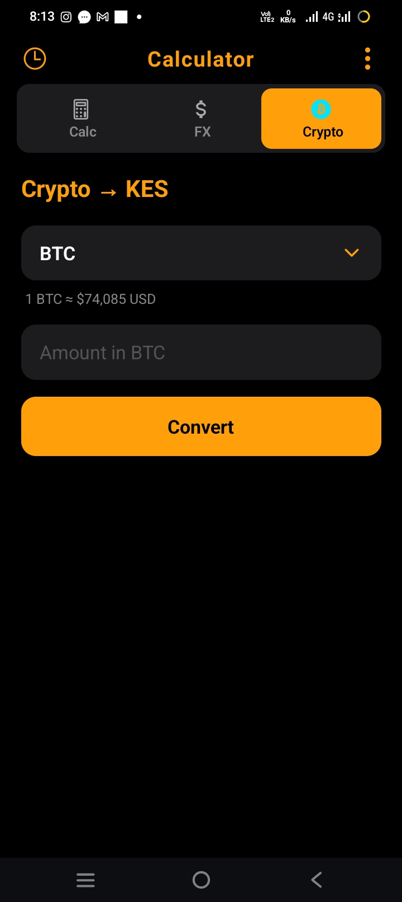

# Welcome to Calculator pro finance app 👋

This is an [Expo](https://expo.dev) project created with [`create-expo-app`](https://www.npmjs.com/package/create-expo-app).


# Screenshots of the app





## Get started

1. Clone the repo

   ```bash
     gitclone:https://github.com/novasec-spec/CalculatorPro.git
     cd ~/CalculatorPro
     ```
2. Install dependencies

   ```bash
   npm install
   ```

3. Start the app

   ```bash
   npx expo start
   ```
4. Install Expo Go from playstore

5. Open Expo Go and paste the url link and view the app 

Enjoy 

In the output, you'll find options to open the app in a

- [development build](https://docs.expo.dev/develop/development-builds/introduction/)
- [Android emulator](https://docs.expo.dev/workflow/android-studio-emulator/)
- [iOS simulator](https://docs.expo.dev/workflow/ios-simulator/)
- [Expo Go](https://expo.dev/go), a limited sandbox for trying out app development with Expo


## Learn more

To learn more about developing your project with Novasec Technologies, look at the following resources:

- [Novasec documentation](https://docs.novasec.dev/): Learn fundamentals, or go into advanced topics with our [guides](https://docs.novasec.dev/guides).
- [Learn Novasec tutorial](https://docs.novasec.dev/tutorial/introduction/): Follow a step-by-step tutorial where you'll create a project that runs on Android, iOS, and the web.

## Join the community

Join our community of developers creating universal apps.

- [Contact Developer](technologiesnovasec@gmail.com): View our open source platform and contribute.
- [Discord community](https://chat.novasec.dev): Chat with Novasec users and ask questions.
